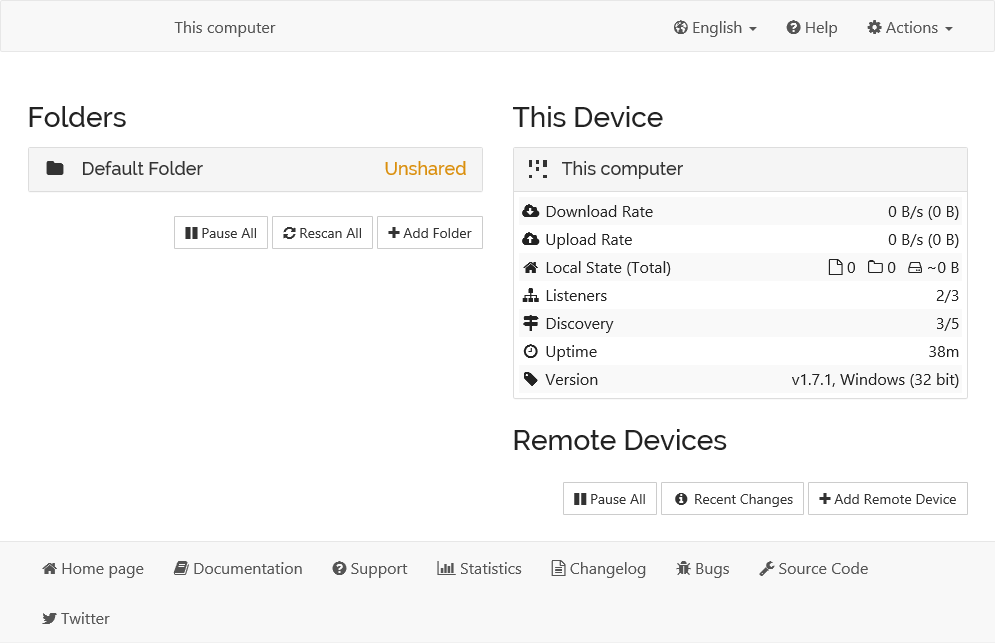
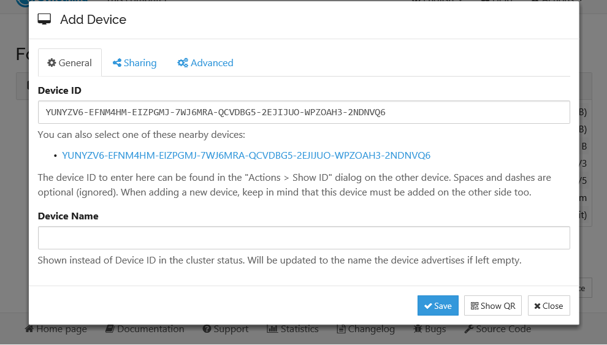
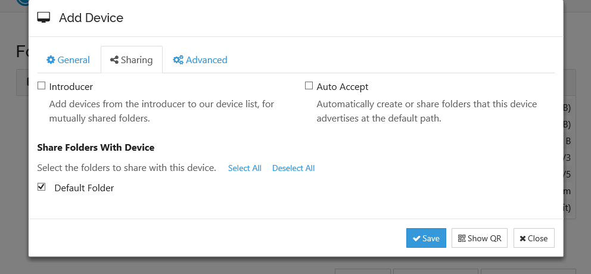
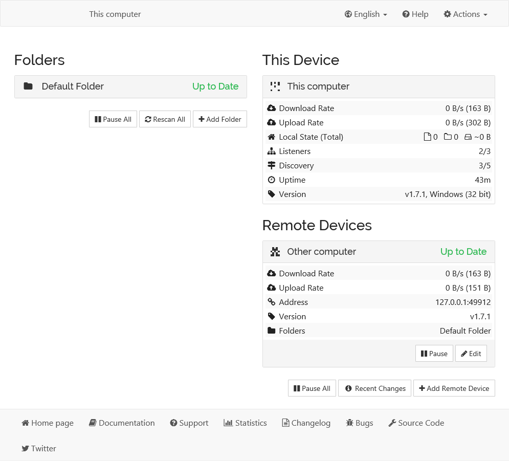

.. _getting-started:

Getting Started
===============

For this guide let's assume you have two machines between which you want
to synchronise files. In keeping with Wesync terminology they are
going to be called "devices" in the rest of the documentation. The
"local device" is the one you are configuring, viewing status for, etc.,
while the "remote device" is the other machine.

The best way to follow this guide is to do the install on both machines
and configure them in parallel. If both machines aren't accessible
simultaneously that's fine, the results will just be a little less
immediately obvious.

Installing
----------

The community has also developed Windows, Android and many
more specific flavors that help you run Wesync on your devices. Currently
all community flavors run the same Wesync core underneath, so don't worry
about changing your flavor at a later point in time. The remainder of this page
will explain how to set up two devices with the core Wesync flavor.

Wesync
~~~~~~~~~

Grab the `latest release`_ of Wesync for your operating system and unpack
it (if you use Debian/Ubuntu you may want to use the `Debian repository`_). 
There will be a binary called ``wesync`` (or ``wesync.exe`` on
Windows). Start this in whatever way you are most comfortable with;
double-clicking should work in any graphical environment, but I'll use the
command line to better illustrate what happens. At first start Wesync will
generate a configuration file, some encryption keys and then start the admin GUI in your
browser. Something like the following will be printed in the command line::

    > wesync
    [monitor] 22:56:32 INFO: Log output saved to file "C:\Users\User\AppData\Local\Wesync\wesync.log"
    [monitor] 22:56:32 INFO: Default folder created and/or linked to new config
    [start] 22:56:32 INFO: wesync v1.7.1 "Fermium Flea" (go1.14.4 windows-386) teamcity@build.wesync.net 2020-07-11 18:17:41 UTC
    [start] 22:56:32 INFO: Default folder created and/or linked to new config
    [start] 22:56:32 INFO: Default config saved. Edit C:\Users\User\AppData\Local\Wesync\config.xml to taste (with Wesync stopped) or use the GUI
    [6FOKX] 22:56:33 INFO: My ID: 6FOKXKK-SKUBWFW-GSKX6IQ-ZC4SYUZ-5IEVZKE-TC42AAX-HW7IBW4-GAZFAQ7
    [6FOKX] 22:56:34 INFO: Single thread SHA256 performance is 123 MB/s using crypto/sha256 (108 MB/s using minio/sha256-simd).
    [6FOKX] 22:56:34 INFO: Hashing performance is 106.31 MB/s
    [6FOKX] 22:56:34 INFO: Overall send rate is unlimited, receive rate is unlimited
    [6FOKX] 22:56:34 INFO: Using discovery server https://discovery.wesync.net/v2/?noannounce&id=LYXKCHX-VI3NYZR-ALCJBHF-WMZYSPK-QG6QJA3-MPFYMSO-U56GTUK-NA2MIAW
    [6FOKX] 22:56:34 INFO: Using discovery server https://discovery-v4.wesync.net/v2/?nolookup&id=LYXKCHX-VI3NYZR-ALCJBHF-WMZYSPK-QG6QJA3-MPFYMSO-U56GTUK-NA2MIAW
    [6FOKX] 22:56:34 INFO: Using discovery server https://discovery-v6.wesync.net/v2/?nolookup&id=LYXKCHX-VI3NYZR-ALCJBHF-WMZYSPK-QG6QJA3-MPFYMSO-U56GTUK-NA2MIAW
    [6FOKX] 22:56:34 INFO: Ready to synchronize "Default Folder" (default) (sendreceive)
    [6FOKX] 22:56:34 INFO: QUIC listener ([::]:22000) starting
    [6FOKX] 22:56:34 INFO: TCP listener ([::]:22000) starting
    [6FOKX] 22:56:34 INFO: Relay listener (dynamic+https://relays.wesync.net/endpoint) starting
    [6FOKX] 22:56:34 INFO: Completed initial scan of sendreceive folder "Default Folder" (default)
    [6FOKX] 22:56:34 INFO: GUI and API listening on 127.0.0.1:8384
    [6FOKX] 22:56:34 INFO: Access the GUI via the following URL: http://127.0.0.1:8384/
    [6FOKX] 22:56:34 INFO: My name is "This computer"
    [6FOKX] 22:56:45 INFO: quic://0.0.0.0:22000 detected NAT type: Symmetric NAT
    [6FOKX] 22:56:45 INFO: quic://0.0.0.0:22000 resolved external address quic://125.190.151.7:59296 (via stun.wesync.net:3478)
    [6FOKX] 22:56:46 INFO: Detected 0 NAT services

At this point Wesync will also have set up a folder called
``Default Folder`` for you, in a directory called ``Sync`` in your home
directory (`%USERPROFILE%` on Windows). You can use this as a starting 
point, then remove it or add more folders later.

.. _`latest release`: https://github.com/umilab/wesync/releases/latest
.. _`Debian repository`: https://apt.wesync.net/

Configuring
-----------

The admin GUI starts automatically and remains available on
``http://localhost:8384/``. Cookies are essential to the correct functioning of the GUI; please ensure your browser accepts them. It should look something like this:

On the left is the list of "folders", or directories to synchronize. You
can see the ``Default Folder`` was created for you, and it's currently
marked "Unshared" since it's not yet shared with any other device. On
the right is the list of devices. Currently there is only one device:
the computer you are running this on.

For Wesync to be able to synchronize files with another device, it
must be told about that device. This is accomplished by exchanging
"device IDs". A device ID is a unique, cryptographically-secure
identifier that is generated as part of the key generation the first
time you start Wesync. It is printed in the log above, and you can
see it in the web GUI by selecting "Actions" (top right) and "Show ID".

Two devices will *only* connect and talk to each other if they are both configured with each other's device ID. Since the configuration must be mutual for
a connection to happen, device IDs don't need to be kept secret. They are essentially part of the public key.

To get your two devices to talk to each other click "Add Remote Device"
at the bottom right on both devices, and enter the device ID of the other side.
You should also select the folder(s) that you want to share. The device
name is optional and purely cosmetic. You can change it later if
desired.

Once you click "Save" the new device will appear on the right side of the
GUI (although disconnected) and then connect to the new device after a minute or so.
Remember to repeat this step for the other device. 

At this point the two devices share an empty directory. Adding files to
the shared directory on either device will synchronize those files to the
other side.

If you are using a Wesync flavor that adds OS specific functionality (e.g. the Android app), you may need to access the Web GUI to enable syncing folders, and other configuration options.

--------------

Good luck and have fun! There is more `documentation
<https://docs.wesync.net/>`__ and if you run into trouble feel free to post
a question in the `support forum <https://forum.wesync.net/c/support>`__.
If you have problems getting devices to connect, first take a look at
:ref:`firewall-setup`, then look at any error messages in the GUI or on the
console. Don't forget that configuration changes will not be reflected
instantly - give Wesync a little time, especially after a restart.
